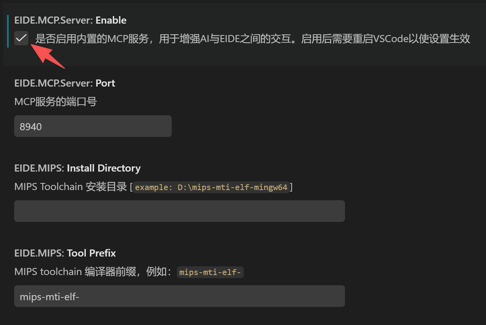

# eide — Claude Code Skill for Embedded IDE

[English](#english) · [中文](#chinese)

---

## English

A [Claude Code](https://claude.ai/code) skill that controls [EIDE (Embedded IDE)](https://github.com/github0null/eide) via its MCP server — build, rebuild, clean, and flash your embedded projects without leaving the chat.

### Prerequisites

- [Claude Code](https://claude.ai/code) (VS Code extension or CLI)
- [EIDE](https://github.com/github0null/eide) VS Code extension — **EIDE.MCP.Server must be enabled** (see below)
- Python 3 (stdlib only, no extra dependencies)

### Enable EIDE MCP Server

In VS Code, open EIDE settings (**`Ctrl+,`** → search **`eide.mcp.server`**), enable the option **EIDE.MCP.Server: Enable** (default port 8940):


- A VSCode workspace with an EIDE-managed embedded project (`.eide/eide.yml`)

### Installation

Clone this repo into your Claude Code skills directory:

```bash
# Linux / macOS
git clone https://github.com/AlexiaQAQ/eide-mcp-skill.git ~/.claude/skills/eide

# Windows (PowerShell)
git clone https://github.com/AlexiaQAQ/eide-mcp-skill.git $env:USERPROFILE\.claude\skills\eide
```

Or copy the `eide` folder into `C:\Users\<you>\.claude\skills\`.

Then restart Claude Code — the skill will auto-register.

### Quick Start

```bash
cd your-eide-project
python <skill-dir>/scripts/eide.py --workspace . uid   # auto-detect Project UID
python <skill-dir>/scripts/eide.py build                # build
python <skill-dir>/scripts/eide.py flash --erase-all    # flash
```

Or simply mention "EIDE" in Claude Code — the skill triggers automatically.

### Commands

| Command | Risk | Description |
|---------|------|-------------|
| `/eide check` | low | Ping the MCP server |
| `/eide reload` | low | Reload project — sync Keil uvproj changes into EIDE model |
| `/eide add-src-dir <path>` | medium | Add a source directory (all .c/.cpp files under it will be compiled) |
| `/eide build` | medium | Incremental build (auto-reloads before build) |
| `/eide rebuild` | medium | Full rebuild (auto-reloads before rebuild) |
| `/eide clean` | high | Clean build artifacts |
| `/eide flash` | high | Program flash (–erase-all to erase chip first) |

### Attribution

This tool communicates with [EIDE (Embedded IDE)](https://github.com/github0null/eide) via its MCP protocol. EIDE is a GPL-3.0 licensed open-source project by github0null. This skill is an independent client — it is not a derivative work of EIDE.

### License

MIT

---

## Chinese

一款用于控制 [EIDE（Embedded IDE）](https://github.com/github0null/eide)嵌入式工程的 Claude Code 技能，通过 EIDE MCP Server 实现构建、重建、清理、烧录。

### 安装

```bash
# Windows
git clone https://github.com/AlexiaQAQ/eide-mcp-skill.git %USERPROFILE%\.claude\skills\eide
```

或将 `eide` 文件夹复制到 `C:\Users\你的用户名\.claude\skills\`。

### 启用 EIDE MCP Server

在 VS Code 中打开 EIDE 设置（**`Ctrl+,`** → 搜索 **`eide.mcp.server`**），勾选 **EIDE.MCP.Server: Enable**（默认端口 8940）：


重启 Claude Code 即可自动注册。

### 快速使用

```bash
cd 你的工程目录
python <skill-dir>/scripts/eide.py --workspace . uid   # 自动获取 UID
python <skill-dir>/scripts/eide.py build                # 编译
python <skill-dir>/scripts/eide.py flash --erase-all    # 烧录
```

或者在 Claude Code 中说「用 EIDE 编译一下」，技能会自动触发。

### 命令一览

| 命令 | 风险 | 说明 |
|------|------|------|
| `/eide check` | 低 | 检测 MCP 服务器连通性 |
| `/eide reload` | 低 | 重载工程 — 同步 Keil uvproj 更改到 EIDE 模型 |
| `/eide add-src-dir <path>` | 中 | 添加源码目录，该目录下的 .c/.cpp 文件参与编译 |
| `/eide build` | 中 | 增量编译（自动先 reload） |
| `/eide rebuild` | 中 | 全量重建（自动先 reload） |
| `/eide clean` | 高 | 清理构建产物 |
| `/eide flash` | 高 | 烧录固件（加 `--erase-all` 擦除全片） |

### 结构

```
eide/
├── SKILL.md             技能定义（前端文案 + 自动触发条件）
├── config.example.json  配置模板（复制为 config.json 后使用）
├── eide-mcp-enable.png   EIDE MCP Server 设置截图
├── package.json         插件元数据
├── scripts/
│   └── eide.py          Python 脚本（封装 MCP 调用，纯标准库）
└── README.md
```
